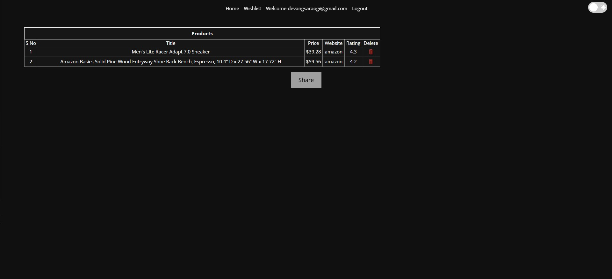

# Slash Your Spending, Not Your Style - Unleash the Best Deals!!

<h2> What is Slash Exactly? </h2>

Slash is a web-scraping tool that aggregates the best deals from leading e-commerce platforms like [Walmart](https://www.walmart.com/), [Target](https://www.target.com/), [BestBuy](https://www.bestbuy.com/),  [Amazon](https://www.amazon.com/), [Google Shopping](https://shopping.google.com/),  [BJs](https://www.bjs.com/),  [Etsy](https://www.etsy.com/), and [EBay](https://www.ebay.com/).
- **Fast**: Save time by comparing deals across websites instantly.
- **Easy**: Use straightforward commands to filter and sort items.
- **Powerful**: Tailor your searches to get precise results quickly.

## Flowchart of Slash

:movie_camera: Watch Our Demo Video
---

# :rocket: Installation

For detailed installation and setup instructions, please refer to [INSTALL.md](https://github.com/Software-Engineering-Folks/slash/blob/sfe-master/INSTALL.md).

 
# :dizzy: What's New? (Project 3 Updates)

### 1. MongoDB
Migrated to MongoDB for improved performance, scalability, and faster data handling. By leveraging MongoDB, we've significantly improved performance and scalability. This powerful database solution allows us to store and manage data more efficiently, providing a smoother and faster user experience.

### 2. Wishlists
Keep track of your desired products by adding them to your wishlist and making shopping more easier.

### 3. Deals of the day
Added a "Deals of the Day" section on the homepage that dynamically scrapes and displays unique, updated daily deals to enhance user engagement

### 4. UI and Bugs Fixes
Implemented UI enhancements on the homepage and fixed bugs related to filtering, sorting, wishlist functionality, and comments to improve the website's usability and performance.

  

Landing Page 

  

Integrated Google Authorization

  

New Feature: Deals of the Day on HomePage

  

Search Results after scraping popular E-Commerce Websites

  

New Feature: Wishlists

  

Feature Upgrade: Commenting

# :muscle: What's Next for future development?

- **General Enhancements**
  - **Caching Scraped Results**: Running the scraper over and over again to fetch the same product is computationally expensive. Introducing a caching system can improve the user experience.
  - **Comparison with Similar Products**: Give users the oppurtunity to compare similar products by comprehensively displaying their features next to each other.
  - **UI Improvements**: Enhancing the user interface by adopting a consistent design language across the website for a cohesive look and feel.
  - **Login Implementation**: Give users the oppurutunity to login without Google services.
- **Chatbot**: Enhance the application by integrating an AI-powered chatbot using OpenAI's GPT models or other AI services. This chatbot will interact with users to understand their product preferences based on feature descriptions and suggest relevant products sorted by relevancy.
- **Price Tracking and Alerts**: Implementing a feature to track product prices over time and notify users of price changes.
- **Wishlist Enhancements**
  - **Multi-Wishlist**: The wishlist functionality can be further enhanced to incorporate different wishlists so that the user can have different wishlists catering to different products.
  - **Wishlist-Based Recommendations**: Introducing personalized product recommendations based on items added to the user's wishlist.
  - **Improved Wishlist Sharing**: Improving Sharing of Wishlists.
- **Coupon Scraping**: Incorporate coupon scraping functionality to help users save even more by automatically finding and applying available discounts.

:thought_balloon: Use Case
---
* ***Students***: Students coming to university are generally on a budget and time constraint and generally spend hours wasting time to search for products on Websites. Slash is the perfect tool for these students that slashes all the unnecessary details on a website and helps them get prices for a product across multiple websites.Make the most of this tool in the upcoming Black Friday Sale.
* ***Data Analysts***: Finding data for any project is one of the most tedious job for a data analyst, and the datasets found might not be the most recent one. Using slash, they can create their own dataset in real time and format it as per their needs so that they can focus on what is actually important.
  
# Additional Information
 For Additional Information direct to this [page](https://github.com/Software-Engineering-Folks/slash/tree/sfe-master/docs)  and check all the markdown files.

:sparkles: Contributors
---
<table>
  <tr>
    <td align="center"><a href="https://github.com/devangsaraogi"> <b>Devang Saraogi</b></a> </td>
    <td align="center"><a href="https://github.com/omtandel2307"> <b>Om Tandel</b></a> </td>
    <td align="center"><a href="https://github.com/snehilbehar"> <b>Snehil Behar</b></a></td>
  </tr>
</table>
